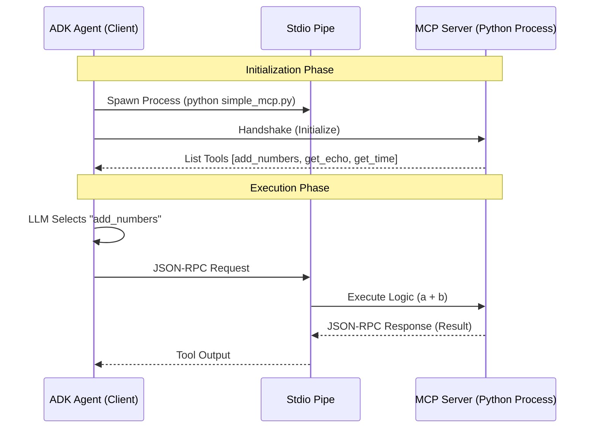

````markdown
# Model Context Protocol (MCP) Integration

This project demonstrates an advanced architectural pattern using the **Model Context Protocol (MCP)** within the Google ADK framework. Unlike standard Function Calling (where logic is embedded in the agent's code), this project decouples the **Tool Logic (Server)** from the **Agent Logic (Client)**.

## 🧠 Logic & Visualization

To understand MCP, we use the **"Universal USB Driver" Analogy**:

- **MCP Server (The Flash Drive):** A standalone process containing specific capabilities (Tools: `add_numbers`, `get_echo`) and resources. It knows nothing about the AI.
- **MCP Client/Agent (The Computer):** Connects to the server via a standard port (Stdio), "reads" the available tools, and dynamically adds them to its toolset.
- **Transport (The USB Cable):** The communication layer. In this project, we use standard input/output (`Stdio`) pipes to send JSON-RPC messages.

### Architecture Diagram

The Agent spawns the Server as a subprocess and communicates via JSON-RPC protocol.
````



## 📂 Project Structure

The project follows a modular structure separating the server implementation from the agent consumer.

```text
.
├── Makefile                        # Automation: install, lint, format, run
├── pyproject.toml                  # Dependencies (mcp, google-adk)
├── src
│   └── mcp_agent
│       ├── agent.py                # CLIENT: The ADK Agent that consumes tools
│       ├── config.py               # CONFIG: Pydantic settings
│       └── servers
│           └── simple_mcp.py       # SERVER: Standalone FastMCP implementation
└── tests                           # Unit Tests
```

## ⚙️ Setup & Installation

1.  **Prerequisites**: Python 3.13+, Poetry installed.
2.  **Environment**:
    Use the `Makefile` to install dependencies (including the `mcp` SDK):
    ```bash
    make install
    ```
3.  **Configuration**:
    Create a `.env` file in the root directory. This project requires a Google API Key.
    ```ini
    GOOGLE__API_KEY=your_actual_api_key
    GOOGLE__GENAI_USE_VERTEXAI=false
    ```

## 🚀 Usage

This command starts the Agent, which automatically launches the MCP Server in the background.

```bash
make run
```

### Expected Output

Observe the system logs. You will see the Agent connecting, discovering tools, and executing them via the protocol.

```text
USER: Calculate 100 + 55 using the tools, and give the current time, and then echo the result.
AGENT:
[SYSTEM: Calling MCP Tool 'add_numbers']
[SYSTEM: Calling MCP Tool 'get_current_time']
[SYSTEM: Calling MCP Tool 'get_echo']
Echo from MCP: 155 (Time: 15/12/2025 10:00)
[SYSTEM: Closing MCP connection...]
```

## 💻 Code Highlights

### 1\. The MCP Server (`simple_mcp.py`)

We use `FastMCP` to quickly expose Python functions as standardized tools. Notice this file has **no dependency** on Google ADK or LLMs. It is pure logic.

```python
from mcp.server.fastmcp import FastMCP

mcp = FastMCP("TimeAndMathServer")

@mcp.tool()
def add_numbers(a: int, b: int) -> int:
    """Add two numbers."""
    return a + b

if __name__ == "__main__":
    mcp.run() # Listens on Stdio
```

### 2\. The Agent Client (`agent.py`)

The Agent doesn't import `add_numbers` directly. Instead, it defines **how to connect** to the server process.

```python
# Define how to run the server script
server_params = StdioServerParameters(
    command="python",
    args=["src/mcp_agent/servers/simple_mcp.py"],
    env={}
)

# Initialize the Toolset
mcp_toolset = McpToolset(connection_params=StdioConnectionParams(server_params))

# The Agent automatically sees tools exposed by the server
agent = LlmAgent(
    name="McpConsumer",
    tools=[mcp_toolset], # <--- Dynamic Tool Loading
    # ...
)
```

## 🏆 Key Takeaways

- **Decoupling:** You can change the server code (or even rewrite it in TypeScript) without changing a single line of the Agent's code.
- **Security:** The Agent runs in its own process; the Tools run in another.
- **Scalability:** You can connect multiple MCP servers (Filesystem, Database, Math) to a single Agent seamlessly.
