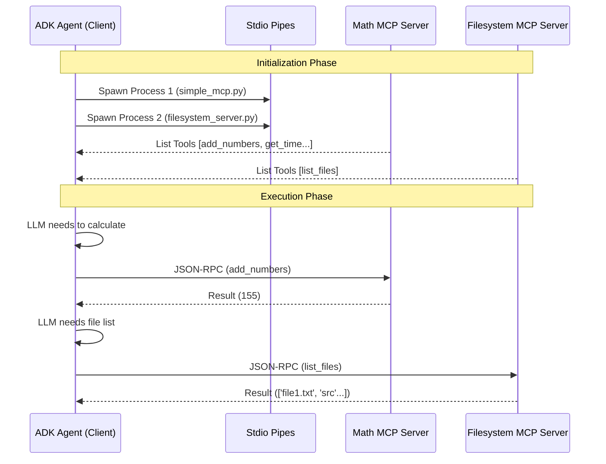

```markdown
# Model Context Protocol (MCP) Integration

This project demonstrates an advanced architectural pattern using the **Model Context Protocol (MCP)** within the Google ADK framework. Unlike standard Function Calling (where logic is embedded in the agent's code), this project decouples the **Tool Logic (Server)** from the **Agent Logic (Client)**.

## 🧠 Logic & Visualization

To understand MCP, we use the **"Universal USB Driver" Analogy**:

- **MCP Servers (The Flash Drives):** Standalone processes containing specific capabilities. We have two:
    1.  **Math Server:** Logic for calculations (`add_numbers`).
    2.  **Filesystem Server:** Logic for accessing local files (`list_files`).
- **MCP Client/Agent (The Computer):** Connects to the servers via standard ports (Stdio), "reads" the available tools, and dynamically adds them to its toolset.
- **Transport (The USB Cable):** The communication layer. In this project, we use standard input/output (`Stdio`) pipes to send JSON-RPC messages.

### Architecture Diagram

The Agent spawns multiple Servers as subprocesses and communicates via JSON-RPC protocol simultaneously.
```



## 📂 Project Structure

The project follows a modular structure separating the server implementations from the agent consumer.

```text
.
├── Makefile                        # Automation: install, lint, format, run
├── pyproject.toml                  # Dependencies (mcp, google-adk)
├── src
│   └── mcp_agent
│       ├── agent.py                # CLIENT: The ADK Agent that consumes tools
│       ├── config.py               # CONFIG: Pydantic settings
│       └── servers
│           ├── simple_mcp.py       # SERVER 1: Math & Time utilities
│           └── filesystem_server.py# SERVER 2: Filesystem operations
└── tests                           # Unit Tests

```

## ⚙️ Setup & Installation

1. **Prerequisites**: Python 3.13+, Poetry installed.
2. **Environment**:
Use the `Makefile` to install dependencies (including the `mcp` SDK):
```bash
make install

```


3. **Configuration**:
Create a `.env` file in the root directory. This project requires a Google API Key.
```ini
GOOGLE__API_KEY=your_actual_api_key
GOOGLE__GENAI_USE_VERTEXAI=false

```


## 🚀 Usage

This command starts the Agent, which automatically launches both MCP Servers in the background.

```bash
make run

```

### Expected Output

Observe the system logs. You will see the Agent connecting, discovering tools from multiple sources, and executing them.

```text
USER: Calculate 100 + 55 using the tools, and give the current time, and give files to the path '../', and then echo the result.
AGENT:
[SYSTEM: Calling MCP Tool 'add_numbers']
[SYSTEM: Calling MCP Tool 'get_current_time']
[SYSTEM: Calling MCP Tool 'list_files']
[SYSTEM: Calling MCP Tool 'get_echo']
Echo from MCP: 155, Time: 15/12/2025 10:00, Files: ['Makefile', 'pyproject.toml', 'src'...]
[SYSTEM: Closing MCP connection...]

```

## 💻 Code Highlights

### 1. The Math Server (`simple_mcp.py`)

Provides basic calculation logic.

```python
@mcp.tool()
def add_numbers(a: int, b: int) -> int:
    return a + b

```

### 2. The Filesystem Server (`filesystem_server.py`)

Provides access to the OS layer. Notice this is a completely separate file/process.

```python
from mcp.server.fastmcp import FastMCP
import os

mcp = FastMCP("FileSystemServer")

@mcp.tool()
def list_files(directory: str) -> dict:
    """Echoes directories files."""
    return {"files": str(os.listdir(directory))}

```

### 3. The Agent Client (`agent.py`)

The Agent connects to multiple tools by defining multiple connection parameters.

```python
# 1. Define Servers
server_params_math = StdioServerParameters(command="python", args=[".../simple_mcp.py"])
server_params_fs = StdioServerParameters(command="python", args=[".../filesystem_server.py"])

# 2. Initialize Toolsets
math_toolset = McpToolset(connection_params=StdioConnectionParams(server_params_math))
fs_toolset = McpToolset(connection_params=StdioConnectionParams(server_params_fs))

# 3. Agent consumes both
agent = LlmAgent(
    name="McpConsumer",
    tools=[math_toolset, fs_toolset], # <--- Multi-source tools
    # ...
)

```

## 🏆 Key Takeaways

* **Decoupling:** You can change the server code (or even rewrite it in TypeScript) without changing a single line of the Agent's code.
* **Security:** The Agent runs in its own process; the Tools run in another.
* **Scalability:** We demonstrated connecting **multiple MCP servers** (Math + Filesystem) to a single Agent seamlessly.

```
